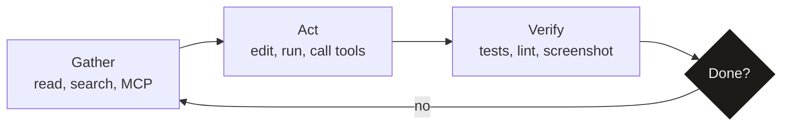

## The agent loop is *just a while loop*

```mermaid
flowchart LR
  G["Gather<br/>read, search, MCP"] --> A["Act<br/>edit, run, call tools"]
  A --> V["Verify<br/>tests, lint, screenshot"]
  V --> D{"Done?"}
  D -- no --> G
  classDef ink fill:#1D1B18,color:#F5F1EA,stroke:#1D1B18
  class D ink
```

::caption::

Gather → act → verify, until the task is done or a limit stops it.
